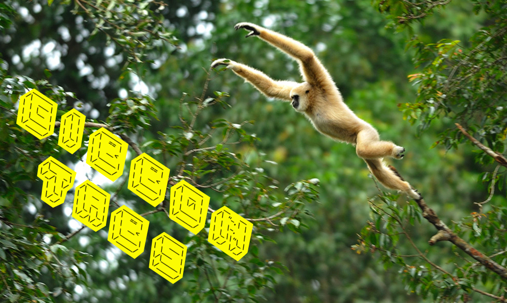
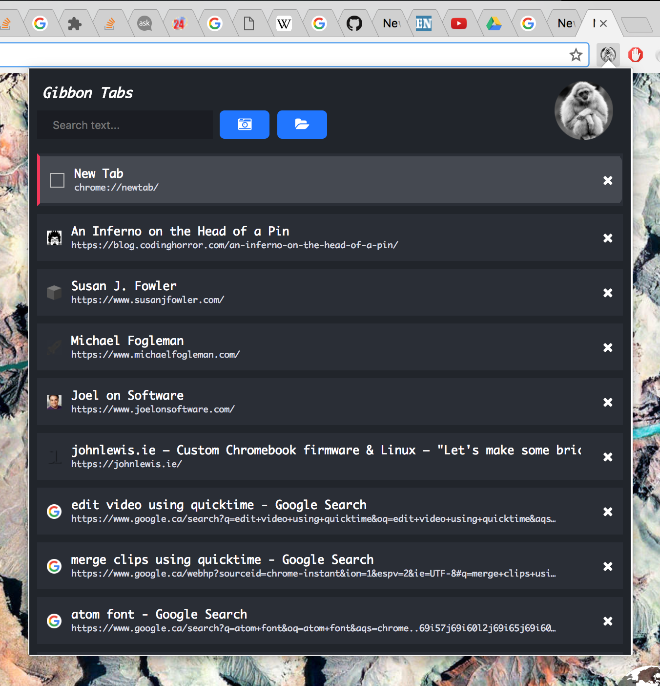
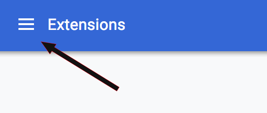
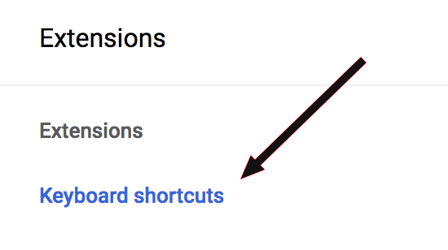
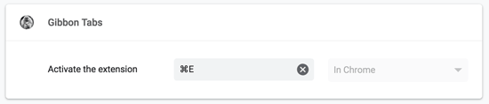

  

# Gibbon Tabs

A Chrome extension to help you navigate your tab jungle with ease. _Now written in React and TypeScript so others can contribute!_

  
    
  <em>Click on this image to see a 1 minute demo of Gibbon Tabs.</em>

## Features

### Tab Management

- __Search and jump__ to tabs by title or URL, across all your windows.
- __Quickly delete tabs__ while being able to see their title and URL.
- Keyboard shortcuts for navigation and tab deletion will make you very fast.

### Save Tabs For Later

- __Tab Snapshots let you save all your open tabs so you can close them and open them later.__
- You can take a snapshot of all your windows, or just the currently active one.
- Snapshots are synchronized across all your devices running Chrome and Gibbon Tabs.
- Take a snapshot of...
  - The internal sites you open at work every morning!
  - All the websites you use to procrastinate. Waste lots of time more effectively!
  - The giant hairy ball of tabs you don't want to close, but you sure as hell don't want to take home at the end of the day either. Free your mind!
- Snapshots are synchronized to your Google profile using [chrome.storage.sync](https://developer.chrome.com/extensions/storage) - I don't have access to your history.

## Requirements

- All you need is Google Chrome. Pretty much any version will work!

## Installation

- Go to the [Chrome Store page](https://chrome.google.com/webstore/detail/gibbon-tabs/bmkakdcikgcicahfkmcehpbhidhccfld) and install the extension.
- __It is highly recommended that you assign a keyboard shortcut to the Gibbon Tabs extension.__
  - In order to do this open [chrome://extensions](chrome://extensions) (type this URL in a new tab)
  - Open the Extensions menu by clicking on the upper left corner.

  

    
  

  
  - Click on "Keyboard Shortcuts".

  

    
  

  - Assign Gibbon Tabs a keyboard shortcut.

  

    
  

  - Refresh the chrome://extension page and the shortcut will become active!

## Usage

- Press the shortcut you assigned or click on the extension icon in your browser to activate it.
- __Type to begin searching__. The search box is always highlighted.
- Press <kbd>Enter</kbd> to activate a tab. Or click on it.
- Use the <kbd>Up</kbd> and <kbd>Down</kbd> keys to navigate the tabs list.
- Press <kbd>Shift</kbd>+<kbd>Backspace</kbd> to delete the currently highlighted tab in the tabs list.
  - You can also delete tabs by clicking on the X at the right side of each tab in the list.
- Press <kbd>Ctrl</kbd> while the extension is open to highlight the currently active tab.
  - When you haven't entered a search query the list shows all tabs ordered from left to right and by window. This lets you quickly find neighbouring tabs to the active window.
- There are no shortcuts for "Tab Snapshots". Just use it once and you'll learn how it works!
- When you open the "Tab Snapshots" dropdown you will see a list of all the snapshots you have saved.
  - Click on the "x" icon next to a snapshot name to delete it.

## Why do I need this?

_If you suffer from one of the following:_

- Having __dozens of tabs__ open in one or multiple windows.
- Constantly fiddling with keyboard shortcuts to find the tab you need, or worse, using your mouse/trackpad.
- The horrible confusion that ensues when the tab favicons disappear because you have too many open tabs. See below:

  
  <em>Welcome to Tab Hell. You can go throw yourself in the lava pit now.</em>

- Heartache and wrist pain.

_Then Gibbon Tabs is for You!_

  
    
  <em>You using Gibbon Tabs.</em>

## Why did you create this & tell me more about the technical crap?

- I wrote Gibbon Tabs in 2016. It was the first side project that I ever shipped to real users. I built this extension to learn about JavaScript and CSS, which I barely understood at the time. I leanred a ton and wrote lots of very unmaintainable spaghetti-JavaScript (look through the old 'master' branch to see what I'm talking about). Despite the poor quality codebase, the product was amazingly performant. It was bug-free and delivered a user experience that I'm still proud of today.
- I decided during quarantine in 2020 to rewrite the codebase using React.js and TypeScript. I did this to learn about both both of these _hot-very-hotman_ technologies. It was a really wonderful learning experience. The codebase is incredibly more maintainable (but still not quite where I would like it to be). I am now a convert into the power of React, and I also see the value of using TypeScript for large JavaScript projects.
- Fuzzy searching is powered by this library: [Fuse](https://github.com/krisk/Fuse)
- I used [tailwind](https://tailwindcss.com/) for the styling. God damn, tailwind is amazing. I can prototype beautiful UIs without having to write a single line of custom CSS.
- What was the hardest part of this project? Writing this damn README.

## Version changes
- __2.0.0__
  - Changes:
    - Migrated the codebase to React and Typescript
    - Removed feature to change contents of tab snapshots (will hopefully add later, I have spent enough time in this rewrite)

- __1.1.2__
  - Changes:
    - Fix very small CSS issue with release 1.1.1

- __1.1.1__
  - Changes:
    - Tabs on the active window now display a small "Window" icon. This helps differentiate duplicate tabs on different windows. For example, haing two gmail clients open. Thanks for the suggestion @ShivanKaul

- __1.1.0__
  - Changes:
    - Ability to overwrite the contents of a snapshot!
    - Use the pencil icon next to the Snapshot name in the Snapshots dropdown.
    - This feature lets you modify the contents of snapshots you have created in the past.
